# MoE Recommendation System Architecture

## Overview

The Mixture of Experts (MoE) Transformer Recommendation System is designed to provide real-time, highly personalized recommendations to millions of users while maintaining low latency and cost efficiency through selective expert activation.

## System Architecture

### High-Level Architecture

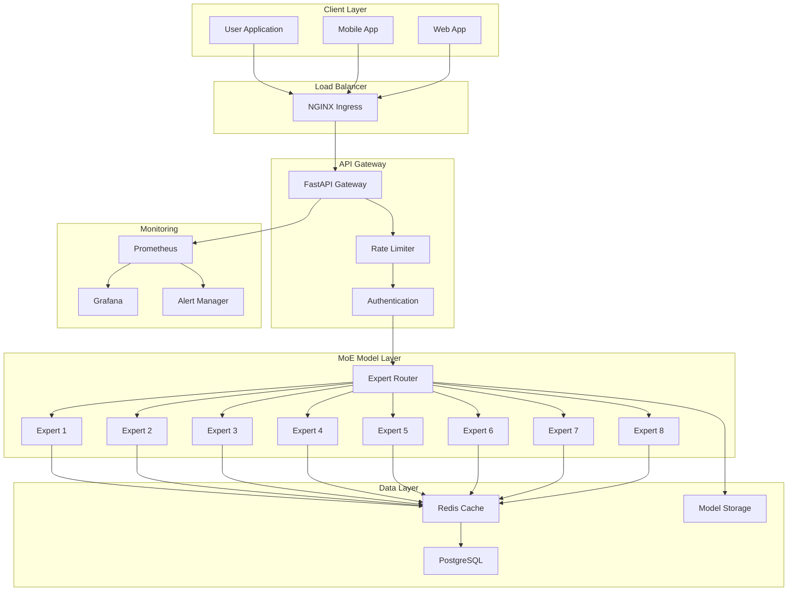

## Expert Activation Flow

### Sequence Diagram

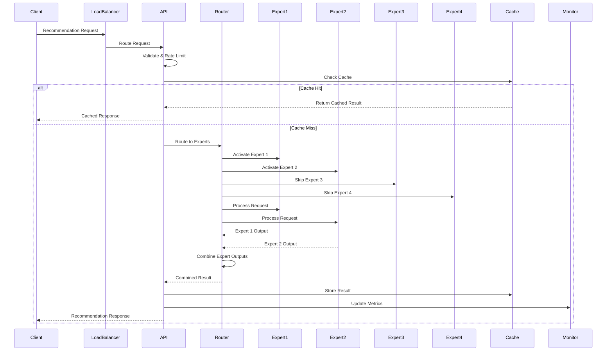

### Expert Routing Algorithm

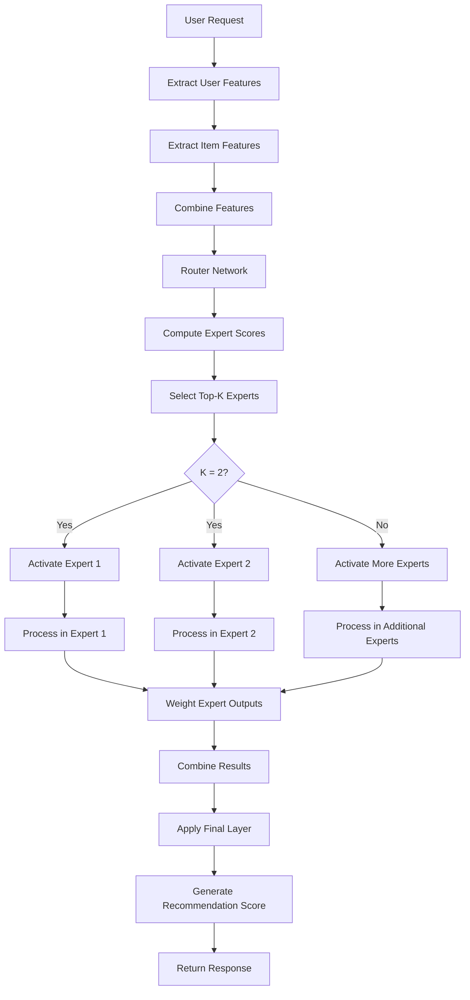

## Data Flow

### Request Processing Flow

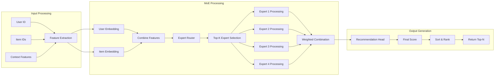

## Performance Characteristics

### Latency Breakdown

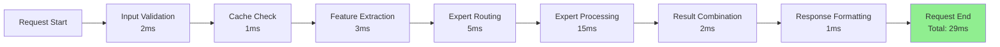

### Expert Utilization

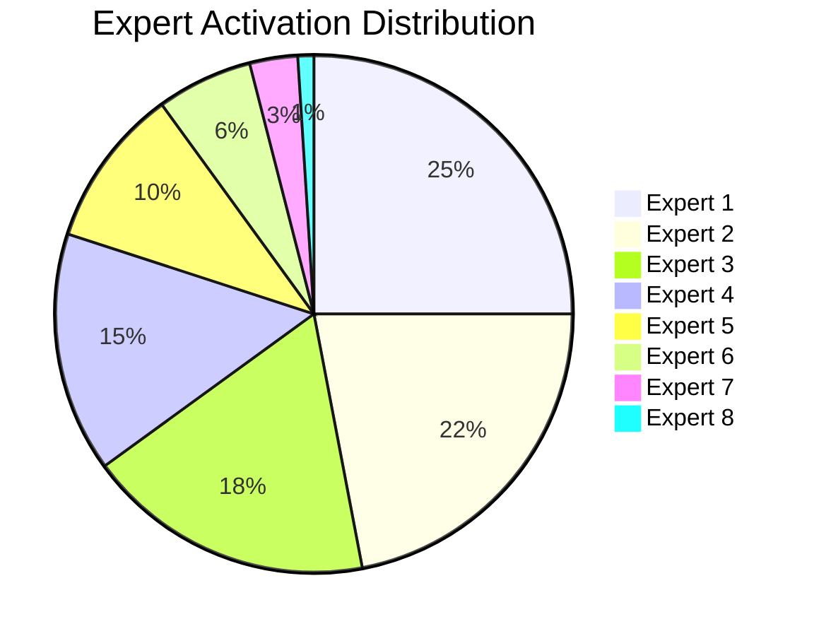

## Security Architecture

### Authentication & Authorization Flow

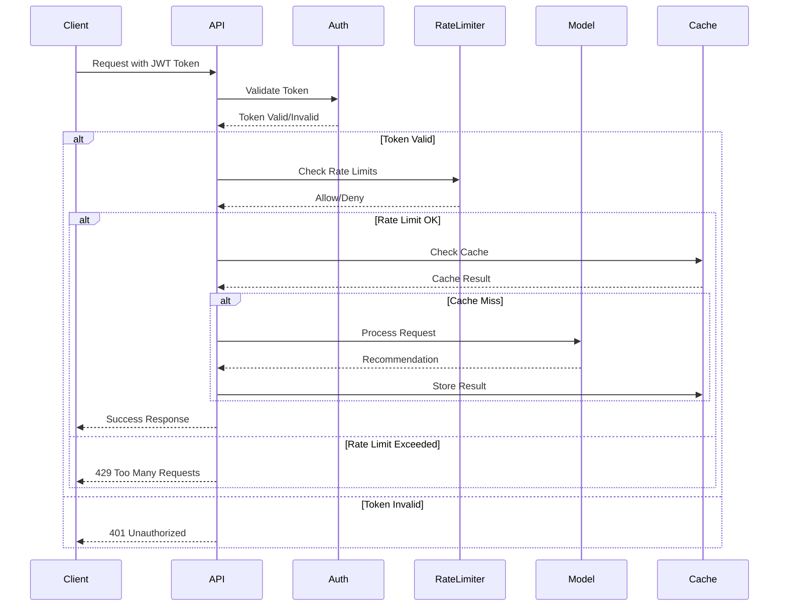

## Monitoring & Observability

### Metrics Collection Flow

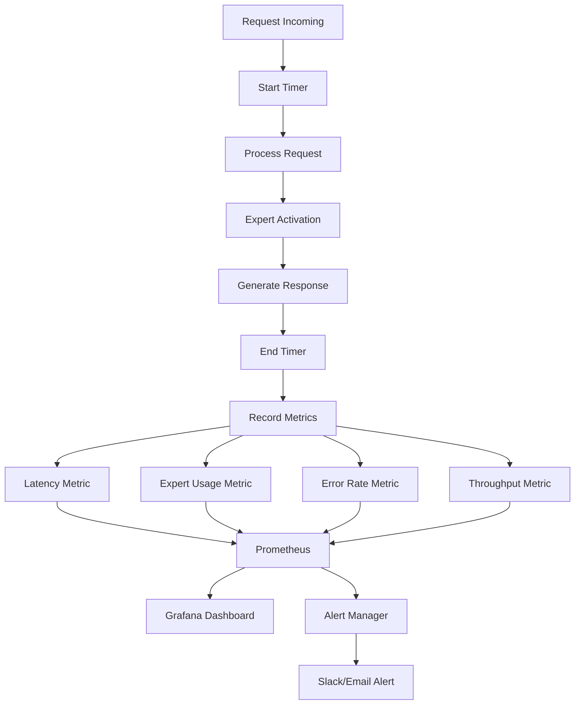

### Key Metrics Dashboard

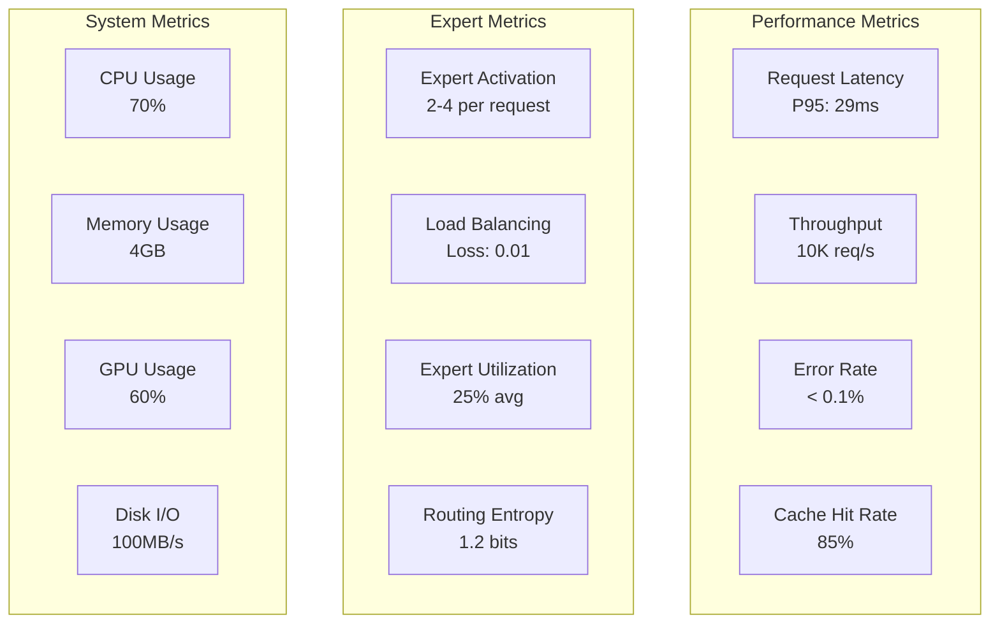

## Deployment Architecture

### Kubernetes Deployment

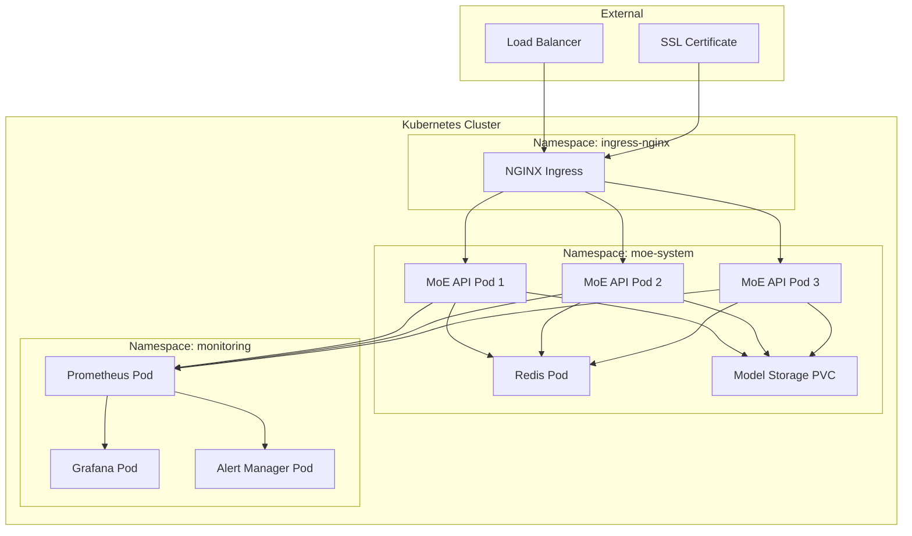

## Cost Optimization Strategy

### Expert Activation Strategy

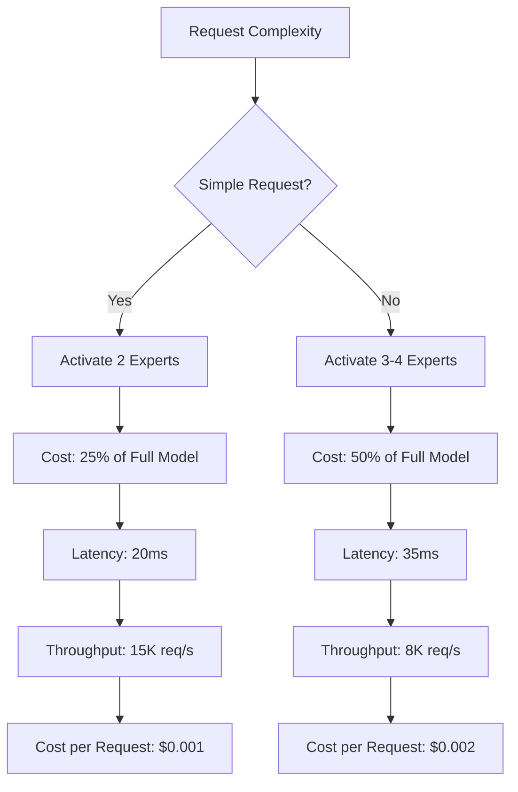

## Scalability Patterns

### Horizontal Scaling

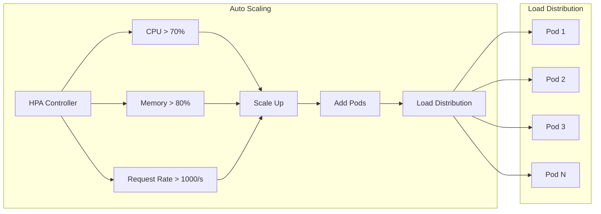

## Error Handling & Resilience

### Circuit Breaker Pattern

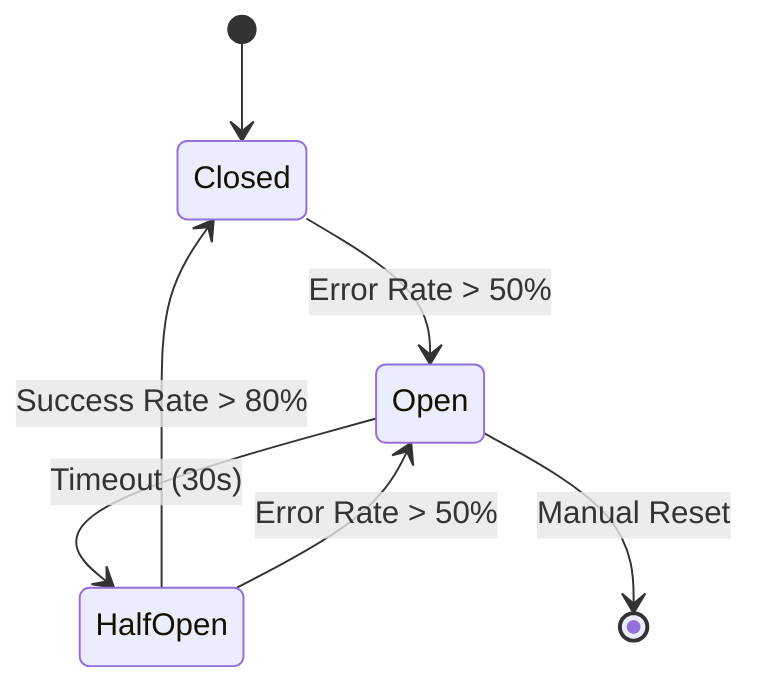

## Data Pipeline

### Training Data Flow

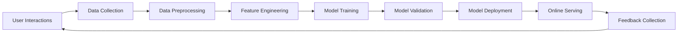

## Security Measures

### Defense in Depth

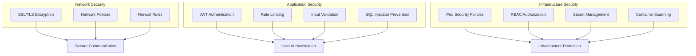

This architecture ensures high performance, scalability, and cost efficiency while maintaining security and reliability for serving millions of users with personalized recommendations. 